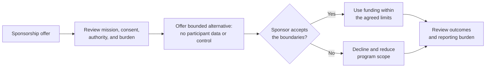

# Example: community sponsorship boundary

- **Provenance:** Fictional
- **Review status:** Illustrative; not community-validated

## Scenario

Harbor Arts Cooperative is a fictional community nonprofit that provides free
creative workshops for local artists and volunteers. A regional company offers
enough sponsorship to fund a full season. In return, it asks for prominent
brand control, access to former participants' contact information, and
unrestricted use of workshop photographs in advertising.

Existing participant permissions cover the cooperative's own program reporting.
They do not cover sponsor promotion or direct sponsor contact. The cooperative
needs funding, but the company is not its only possible supporter.

## Scenario decision view

This is the scenario's decision structure, not a universal sponsorship
procedure. Funding remains one consideration; participant agency and community
authority control both branches.

## Six-concern review

### Purpose

The cooperative exists to provide safe, accessible creative opportunities and
build participant capability. Funding serves that purpose only when it does not
transfer control or turn participants into promotional inventory.

The intended beneficiaries are current and future participants. Protecting
their agency remains more important than maximizing the season's budget.

### Context

The board reviews the written offer, current permissions, program commitments,
likely funding shortfall, and the sponsor's requested rights. It does not assume
that prior participation or a guardian's reporting permission creates consent
for advertising or direct contact.

Two open questions remain: whether the sponsor will accept a bounded alternative
and whether smaller grants can preserve the most important workshops.

### Contribution

The company can contribute funding without gaining participant access or
program control. The cooperative proposes:

- acknowledgment at a level consistent with other supporters;
- aggregate, non-identifying program outcomes;
- a public showcase in which participants choose independently whether to
  display work; and
- no participant list, direct marketing, or reuse of existing photographs.

The proposal makes clear that sponsorship does not purchase endorsement,
curriculum authority, or personal data.

### Relationship

The cooperative has a prospective funding relationship with the company and
ongoing duties to participants. Its responsibilities to participants take
precedence over preserving sponsor goodwill.

The program director records the company's decision and any promise made by the
cooperative. Participant permissions are not broadened to make the deal easier.

### Judgment

The board authorizes the program director to offer the bounded alternative. If
the company keeps participant access or unrestricted media rights as a
condition, the cooperative will decline and reduce the season's scope.

This decision accounts for mission, power, consent, financial pressure, staff
capacity, and the real cost of fewer workshops. It does not pretend that
declining the money is cost-free.

### Learning

The company accepts aggregate outcomes and voluntary showcase acknowledgment
but withdraws its request for participant data. After the season, the
cooperative finds that sponsor reporting took more staff time than expected.

It keeps the consent boundary and changes future sponsorship review to include
an explicit estimate of reporting burden. It does not generalize one sponsor's
conduct into a rule that all commercial support is harmful.

## Result

The framework helps a mission-led group weigh useful funding against community
authority, privacy, workload, and sustainability. The result depends on named
human judgment and ordinary governance, not a score or technical permission
system.

## Framework trace

- [Contribution concern](../framework/operating-framework.md#contribution)
- [Choose move](../framework/practice-method.md#choose)
- [Contribution and power](../framework/responsible-practice-standard.md#contribution-and-power)
