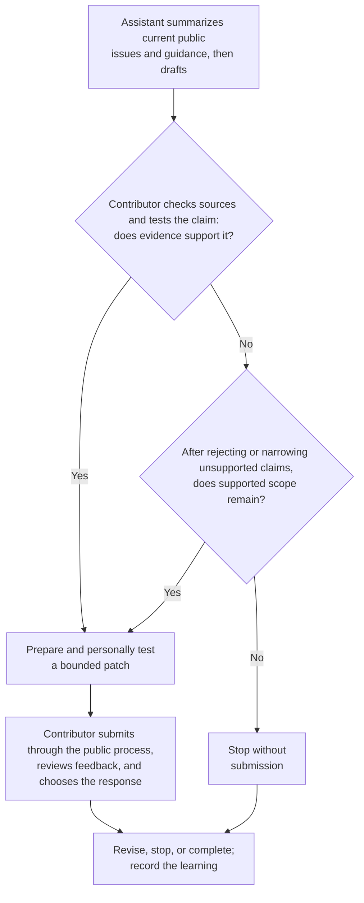

# Example: assisted open-source contribution

- **Provenance:** Fictional
- **Review status:** Illustrative; not community-validated

## Scenario

Devon Price contributes occasionally to the fictional Civic Data Commons, an
open-source project used by small public-interest organizations. Maintainers
have labeled several documentation issues for new contributors. Devon wants to
use an AI assistant to understand repeated questions and prepare a documentation
improvement.

The public issue tracker and project documentation are sufficient for this
work. Devon has no need to research maintainers' personal profiles or contact
them privately.

## Scenario decision view

This diagram is specific to the fictional contribution. The assistant does not
decide sufficiency, submit the patch, respond to review, or authorize later
actions.

## Six-concern review

### Purpose

Devon's purpose is to reduce setup confusion for new contributors and leave the
project's documentation easier to maintain. Contribution and learning remain
worthwhile even if the patch receives little attention or no new professional
opportunity.

### Context

Devon asks the assistant to summarize only current public issues, contribution
guidance, and relevant documentation. The assistant groups repeated questions
and suggests that an installation step is missing.

Devon checks every cited issue and discovers that one summary combined two
different operating-system problems. The combined claim is rejected. The
remaining evidence supports a narrower clarification for one supported setup.

### Contribution

Devon drafts a small documentation patch with the assistant, then personally
tests the steps in the supported environment. The change cites the public issue,
uses the project's established style, and avoids promising support for systems
the project does not cover.

The assistant's prose is treated as a draft. Devon remains the contributor,
reviews the exact patch, and is accountable for its claims.

### Relationship

Devon is a contributor using the project's public process. A maintainer's issue
reply does not imply friendship, endorsement, or consent for private outreach.
No personal notes or inferred interests are retained.

### Judgment

Devon chooses to submit the bounded patch through the normal contribution
channel. The assistant does not select people to contact, post the change,
respond to review, or decide that the evidence is sufficient.

When a maintainer asks for a different example, Devon reviews the request and
decides whether to revise. The prior human decision does not authorize future
assistant-generated changes automatically.

### Learning

The patch is merged after revision. The useful outcome is clearer documentation
and a corrected assumption about the two operating-system issues—not the merge
count itself.

Devon adopts one local practice change: require a direct source check whenever
an assistant combines multiple issue reports into one claim. The lesson remains
local until repeated evidence justifies broader guidance.

## Result

Assistance supports synthesis and drafting while the practitioner retains
evidence review, scope, authorship, submission, and follow-through. Net effort
saved or added is unknown; source correction and testing also take time. The example
does not require a particular model, agent protocol, or automation system.

## Framework trace

- [Context concern](../framework/operating-framework.md#context)
- [Understand move](../framework/practice-method.md#understand)
- [Human judgment and assisted work](../framework/responsible-practice-standard.md#human-judgment-and-assisted-work)
