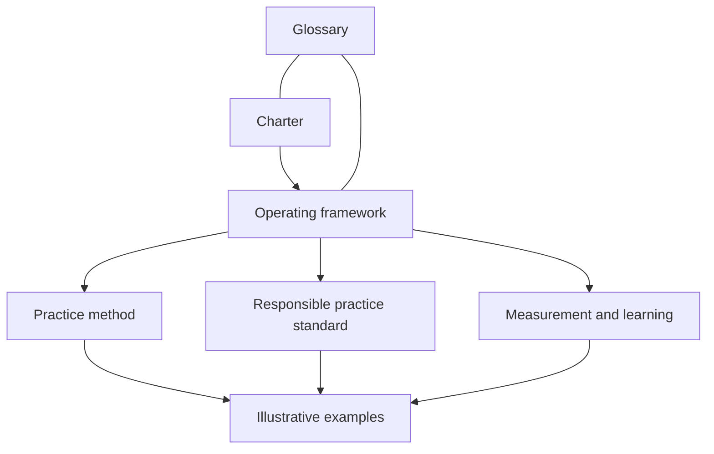

# Framework

This directory contains the canonical Influence Operating Framework.

## Reading order

1. [Charter](charter.md) — definition, mission, commitments, scope, and
   accountability.
2. [Operating framework](operating-framework.md) — the six concerns every
   responsible influence practice should make clear.
3. [Practice method](practice-method.md) — seven practical moves for applying
   the concerns.
4. [Responsible practice standard](responsible-practice-standard.md) — evidence,
   privacy, consent, conduct, and human-judgment boundaries.
5. [Measurement and learning](measurement-and-learning.md) — outcome dimensions,
   reflection, and improvement.
6. [Glossary](glossary.md) — the framework's approved vocabulary.

The charter bounds the framework. The operating framework defines its six
concerns. The practice method helps people apply them. The responsible practice
standard establishes minimum conduct. Measurement and learning explain how the
practice improves.

[Examples](../examples/README.md) illustrate this relationship but do not add
framework requirements. Project plans, reviews, tools, and implementation
artifacts are not canonical framework content.
