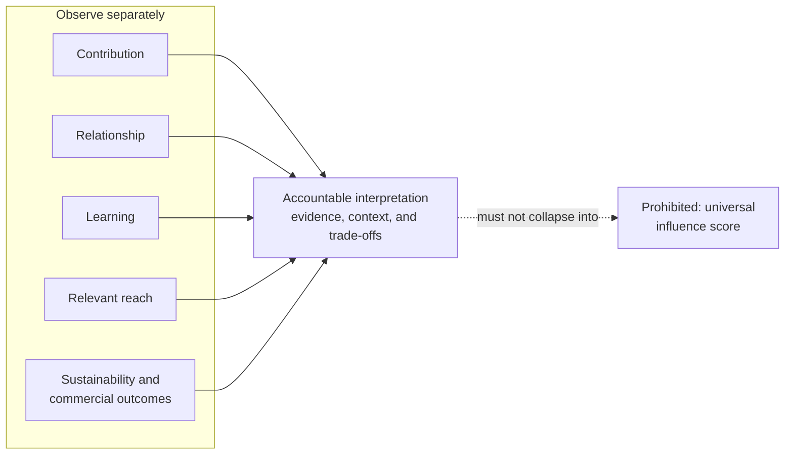

# Measurement and learning

Measurement helps a practitioner understand whether the practice creates value
and remains sustainable. It does not reduce influence to one score.

## Five outcome dimensions

Observe these dimensions separately:

### Contribution

What useful value was created, for whom, and with what evidence of use or
completion?

Possible observations include artifacts completed, needs addressed,
accessibility improved, requested help delivered, ownership transferred, or
new contributors enabled. Counts need an explanation of usefulness and burden.

### Relationship

Were commitments honored, boundaries respected, context preserved, and trust
supported?

Possible observations include promises completed, introductions made with
consent, repairs attempted, helpful continuity, explicit feedback, or a healthy
decision not to follow up. Frequency alone does not indicate relationship
quality.

### Learning

What assumption changed, capability improved, or practice became clearer?

Possible observations include a failed hypothesis, a changed contribution, a
new community insight, an improved boundary, a reusable lesson, or a decision
to stop ineffective activity.

### Relevant reach

Did useful work reach people for whom it was relevant?

Possible observations include participation, readership, reuse, invitations,
referrals, or requested amplification. Reach is interpreted alongside audience
fit, accessibility, usefulness, and community context. Larger is not
automatically better.

### Sustainability and commercial outcomes

Did the practice remain viable for the practitioner and community?

Possible observations include manageable workload, maintained artifacts,
shared ownership, paid opportunities, sponsorship, revenue, or reduced waste.
Commercial outcomes are legitimate when they are transparent and consistent
with contribution, consent, and purpose.

Assess operational sustainability and commercial outcomes separately within
this dimension. Revenue does not cancel unsustainable burden, and low revenue
does not erase demonstrated community value.

## Outcome view

This is an interpretation view, not a sequence or shared scale. Each dimension
retains its own evidence, and accountable judgment keeps their trade-offs
visible without turning them into one score.

## No universal score

The dimensions can conflict. A small workshop may create strong contribution
and learning with little reach. A widely viewed artifact may create visibility
without useful action. A paid engagement may fund valuable work while imposing
unsustainable preparation cost.

Do not combine the dimensions into a universal influence score. If a temporary
rating helps compare options, define its meaning, preserve the underlying
narrative, and let a person override it.

## Reflection

Reflect after meaningful contribution, engagement, completion, rejection,
surprise, missed commitment, harm concern, or deliberate no-action decision.

Use five prompts:

1. **Purpose and outcome:** What were we trying to accomplish, what happened,
   and did the declared purpose advance?
2. **Evidence:** Which observations support the account, and what remains an
   interpretation or open question?
3. **Effects:** Who benefited, who carried cost, and which boundary mattered?
4. **Learning:** Which assumption changed or remained unresolved?
5. **Response:** What should repeat, stop, change, or be tested, and how broadly
   does the evidence support that lesson?

Activity, visibility, or revenue alone does not demonstrate that purpose
advanced. A before-and-after change does not by itself show that a contribution
caused it. Distinguish completion, evidence of use, reported benefit and causal
impact; name alternative explanations and missing evidence. Do not require
feedback, testimonials or continued contact to validate a contribution. A
recipient may decline evaluation, and the outcome can remain unknown.

Record failures with the same care as successes. Do not rewrite the original
expectation after seeing the outcome.

## Maintaining the practice

Choose no change, a small adjustment, a bounded experiment, or a framework
proposal. Name the accountable owner, affected practice, evidence, expected
effect, and next review. Prefer the smallest useful change and keep experiments
reversible where practical. A tool may suggest patterns or draft changes, but
an accountable person decides whether to adopt them.

## Review cadence

Choose a cadence proportional to the work:

- after a consequential event, commitment, or external communication;
- periodically for continuing ecosystems and relationships;
- when capacity, mission, community norms, or material evidence changes; and
- before carrying an old assumption into a new context.

Review is complete when the practitioner can explain current commitments,
important outcomes, stopped work, credible lessons, and the next bounded
decision. Producing more metrics is not completion.
