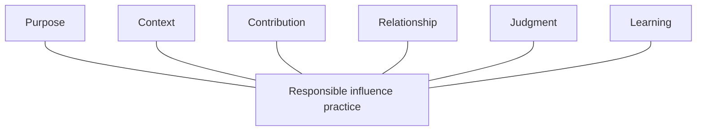

# Operating framework

The framework consists of six concerns that every responsible influence
practice should make clear: Purpose, Context, Contribution, Relationship,
Judgment, and Learning.

They are concerns, not departments, database entities, maturity levels, or
mandatory stages. A practitioner can apply them to an existing activity in any
order and revisit them whenever circumstances change.

## Purpose

**Governing question:** Why are we participating, and who should benefit?

Purpose connects an activity to a declared mission, a real community or need,
and the practitioner's available capacity. It prevents visibility, access, and
activity from becoming ends in themselves.

A clear practice states:

- the mission or goal the activity serves;
- the people or community expected to benefit;
- why participation is appropriate now;
- what the practitioner can responsibly offer; and
- what would make stopping or declining the better choice.

Purpose is weak when the only answer is audience growth, status, proximity,
content volume, or fear of missing out. Commercial benefit can be legitimate,
but it must be named alongside community value, cost, and obligations.

## Context

**Governing question:** What do we know, how do we know it, and what remains
unknown?

Context supports understanding without turning people and communities into an
intelligence inventory. It includes relevant evidence, history, norms,
constraints, contradictions, and uncertainty.

A clear practice states:

- the question that research or observation is meant to answer;
- the sources and lived context supporting material claims;
- which statements are observed facts, interpretations, or open questions;
- what is current, stale, disputed, private, or unnecessary; and
- when existing knowledge is sufficient for the decision at hand.

Public availability does not make all information appropriate to collect or
use. Consequential claims—such as a person's current role, an event deadline,
or a communication boundary—should be checked close to the decision they
inform. Unknown is an acceptable result.

## Contribution

**Governing question:** What useful value can we create without requiring
reciprocity?

Contribution is a concrete act or artifact intended to help a person,
community, or ecosystem. It begins with an evidenced need rather than a
preselected service, talk, or product.

A clear practice states:

- the need and how it was expressed or observed;
- the intended beneficiary;
- the value offered and the burden it may create;
- consent, accessibility, ownership, credit, and maintenance considerations;
- the practitioner's commitment and capacity; and
- what is explicitly not expected in return.

Contribution does not purchase attention, endorsement, access, or a future
favor. A contribution that centers the practitioner, duplicates existing work,
creates an unwanted obligation, or leaves maintenance costs with others should
be changed or stopped.

## Relationship

**Governing question:** What shared history, commitments, consent, and
boundaries matter?

Relationship means truthful continuity between people or groups. It is not a
score, stage, asset, or assumption of closeness. Shared attendance, employment,
a follow, a like, or a public reply does not by itself establish a personal
relationship.

A clear practice states:

- what interaction or shared context actually occurred;
- what each party has explicitly promised or requested;
- which communication preferences and boundaries apply;
- whether follow-through, repair, waiting, no action, or closure is appropriate;
  and
- what context is necessary to retain—and what should not be retained.

Promises should be honored before new opportunities are pursued. Silence is not
consent or automatic permission to retry. A relationship can be healthy without
producing a next action.

## Judgment

**Governing question:** What should an accountable person decide now?

Judgment turns purpose, context, contribution, and relationship into a
proportionate decision. Tools may organize evidence, identify omissions, or
prepare drafts. They do not decide that a person should be contacted or that a
risk is acceptable.

A clear practice states:

- the decision owner;
- the reasonable options considered;
- the evidence, uncertainty, trade-offs, and affected people;
- the chosen action, limits, and stop conditions; and
- what new information would cause reconsideration.

Valid decisions include proceed, contribute first, research further, revise,
wait, decline, no action needed, and do not contact. A numerical score may aid
comparison within a declared context, but it cannot replace explanation or
rank human worth.

## Learning

**Governing question:** What happened, what changed, and how should the practice
improve?

Learning compares intention with observed outcome and converts credible lessons
into proportionate change. It includes success, failure, rejection, restraint,
unintended burden, and changed circumstances.

A clear practice states:

- what was expected and what actually occurred;
- which observations support the interpretation;
- who benefited and who carried cost;
- what assumption was strengthened, challenged, or left unresolved;
- what should repeat, stop, change, or be tested; and
- who can authorize a lasting change to the practice.

A single outcome rarely justifies a universal rule. Improvements should remain
small enough to explain, review, and reverse when practical.

## Using the six concerns

For a quick review, answer one sentence for each concern. For consequential or
long-running work, make the answers durable enough that another accountable
person can understand the reasoning, commitments, boundaries, and open
questions.

The concerns are complete when the practitioner can make a responsible
decision—not when every possible fact has been collected or every activity has
produced a measurable result. If a concern cannot be answered proportionately,
the safe outcome is to narrow the work, seek the missing context, wait, or stop.
