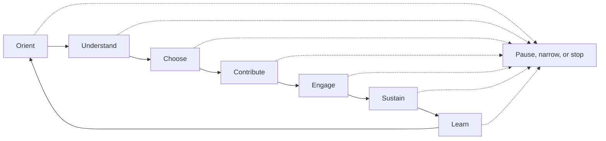

# Practice method

The practice method helps a practitioner move from intention to responsible
participation and learning. It groups the work into seven moves:

> Orient → Understand → Choose → Contribute → Engage → Sustain → Learn

The moves are not a funnel. They may overlap, repeat, pause, or end without
engagement. Researching a person or community never creates an obligation to
contact them.

## Orient

Orient the work around purpose rather than a person to target or a platform to
use.

1. State the mission, community, or problem that matters.
2. Name the intended beneficiaries and the practitioner's legitimate role.
3. Set a useful question, boundary, time horizon, and capacity limit.
4. Identify existing commitments that must come before new activity.
5. Define conditions that would make waiting, declining, or stopping correct.

**Checkpoint:** There is a reason to participate that remains worthwhile even
without recognition, access, or commercial return.

## Understand

Gather only the context needed to participate carefully and make the next
decision.

1. Begin with community-owned, primary, or directly authorized sources.
2. Separate observed facts from interpretation and unanswered questions.
3. Verify consequential current details close to use.
4. Notice ecosystem relationships without assuming personal familiarity.
5. Preserve relevant contradictions and uncertainty.
6. Stop collecting when additional information no longer changes the decision
   proportionately.

Understanding an ecosystem means seeing needs, norms, contributors,
organizations, events, channels, projects, and constraints in relation to the
declared question. It does not require a comprehensive graph or directory.

**Checkpoint:** The practitioner can explain what is known, what is uncertain,
and why the retained context is necessary.

## Choose

Choose among reasonable options using narrative judgment rather than a hidden
ranking.

Consider:

- mission alignment and community value;
- evidence quality and uncertainty;
- practitioner skill, capacity, timing, and cost;
- consent, privacy, accessibility, power, and reputation risk;
- existing relationships and promises;
- learning, artifact, reach, and legitimate commercial possibilities; and
- what must be stopped or deferred to make room.

The decision may be to pursue, contribute first, research further, revise,
wait, decline, take no action, or not contact someone. If ratings are useful,
keep them few, define them for the decision, and explain the result in words.

**Checkpoint:** A named person can explain the decision, its trade-offs, and
what evidence would reverse it.

## Contribute

Create or support something useful in response to a real need.

Possible contributions include documentation, teaching material, issue triage,
code, facilitation, requested amplification, accessible summaries, thoughtful
feedback, volunteer service, sponsorship without control, or an introduction
with consent from both sides.

Before committing, clarify:

- the need and intended benefit;
- scope, ownership, collaborators, and timing;
- accessibility, consent, credit, and maintenance;
- cost or burden transferred to others;
- evidence of completion; and
- what is not expected in return.

**Checkpoint:** The contribution is proportionate, can be declined or
redirected, and does not make reciprocity a condition.

## Engage

Engage when there is a truthful, relevant reason and the context supports it.
Engagement includes public participation, conversation, collaboration,
speaking, teaching, media, introductions, and direct communication.

Before direct outreach:

1. Verify the person's current role and the reason for writing.
2. Check known communication preferences, prior requests, waiting decisions,
   and do-not-contact boundaries.
3. Prefer a lower-burden public contribution when it serves the purpose.
4. Make any request plain, proportionate, and easy to decline.
5. Remove false familiarity, generic flattery, pressure, and manufactured
   urgency.
6. Have the accountable practitioner review the exact communication before it
   is sent through a separately controlled channel.

The framework does not send messages. Approval of a draft is a judgment about
the draft, not an instruction that any system must transmit it.

**Checkpoint:** The engagement is truthful, necessary enough, respectful of
boundaries, and owned by the person taking the action.

## Sustain

Sustain the relationships and work that resulted without manufacturing
activity.

1. Fulfill promises before creating new asks.
2. Record only the context needed to honor continuity and boundaries.
3. Give credit and return ownership where appropriate.
4. Follow up only when there is a truthful reason.
5. Repair mistakes directly when possible.
6. Recognize that quiet, closure, and no action can be healthy states.

**Checkpoint:** Commitments are accounted for, and any next action serves the
relationship or purpose rather than a cadence.

## Learn

Compare expectations with observed outcomes and decide what the practice should
retain or change.

Ask:

- What actually happened?
- What did we expect?
- Who benefited and who carried cost?
- What evidence supports our interpretation?
- What worked, failed, surprised, or caused unintended burden?
- What should repeat, stop, change, or be tested?
- Is the lesson local, or does it justify a broader framework proposal?

**Checkpoint:** The lesson is specific enough to act on and modest enough for
the evidence supporting it.

## Completion, stopping, and recovery

A cycle is complete when its intended contribution, decision, relationship
commitment, or learning outcome has been accounted for. It can also complete
successfully with a decision to wait, decline, take no action, or not contact
someone.

Stop or narrow the work when evidence is insufficient, capacity changes,
consent is absent, boundaries are unclear, the contribution is unwanted, or
expected harm exceeds value. Preserve the reason and any open commitment, then
resume only if the relevant condition changes.

## Applying the method at different scales

- **A single decision:** Use the seven moves as a short set of prompts.
- **An event or opportunity:** Apply them before, during, and after
  participation.
- **A continuing relationship:** Emphasize context, commitments, boundaries,
  and sustainment rather than constant engagement.
- **A community or ecosystem:** Orient around a bounded question and shared
  needs, not an exhaustive map.
- **A recurring practice:** Review outcomes periodically and change only what
  observed experience supports.
