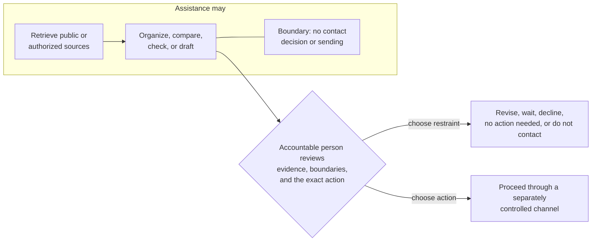

# Responsible practice standard

This standard defines the minimum conduct expected when applying the Influence
Operating Framework. It governs practice, regardless of which people, tools, or
systems assist with the work.

## Evidence and uncertainty

Material claims should be distinguishable as:

- **Observed fact:** Directly supported by an identified public, community-owned,
  or authorized source.
- **Interpretation:** A reasoned reading of identified facts for which other
  explanations may remain possible.
- **Open question:** Something not yet known well enough to use as fact.

Prefer current primary sources for consequential details. Secondary sources can
add independent reporting or history. Search snippets, aggregators, and machine
summaries are discovery aids, not sufficient evidence when a practical primary
source exists.

Confidence describes support, not importance. Unknown, disputed, and stale are
valid states. Do not upgrade uncertainty because a confident answer would be
more convenient.

## Proportional research

Research begins with a decision or contribution question and stops when the
next responsible decision can be made. Collecting everything that might be
useful later is not a framework objective.

Before retaining context, ask:

- What decision or commitment does this information support?
- Is it public or directly authorized for this use?
- Could the purpose be met with less detail?
- How quickly could it become stale?
- Who could be harmed if it were wrong, exposed, or used outside context?
- When should it be corrected, reviewed, or removed?

Do not collect private contact details, family information, precise personal
location, sensitive traits, inferred vulnerabilities, or unrelated personal
history for influence work. Public availability is not blanket permission to
retain or combine information.

## Truthful relationships

Describe only interaction and relationship context that actually exists.

- Co-attendance does not prove a meeting.
- A follow, like, or public reply does not prove familiarity.
- Shared employment or community membership does not prove endorsement.
- An unanswered message does not prove rejection or permission to retry.
- A contribution does not create a debt.
- A referral or introduction requires appropriate consent from the people
  affected.

When recollections conflict, preserve uncertainty and reduce the claim rather
than manufacturing agreement.

## Consent and communication boundaries

Known communication preferences, requests to wait, and do-not-contact decisions
take precedence over an opportunity to engage. Silence is not consent.

Honor a boundary set by an affected person or their authorized representative
until that person or representative affirmatively changes it. An accountable
practitioner may revisit only the practitioner's own internal precaution, and
only after reviewing current context and risk.

Elapsed time, a new opportunity, a different channel, or lack of response does
not reverse a recipient-set boundary.

A direct communication should have:

- a truthful and current reason;
- a proportionate request, if any;
- an appropriate channel and timing;
- language that is easy to decline;
- no unsupported familiarity or endorsement; and
- an accountable person who reviews and chooses the action.

Do not contact is a normal protective decision, not a negative judgment of a
person. A tool may not remove or weaken any such boundary automatically.

## Human judgment and assisted work

People may use software and AI to retrieve public sources, organize notes,
identify contradictions, compare declared considerations, prepare drafts,
check accessibility, or assemble reflection material. The accountable person
still owns the judgment and action.

Software and AI must not independently:

- fabricate a missing fact, relationship, role, quotation, endorsement, or
  contact detail;
- present inference as verified fact;
- decide that a person should be contacted;
- bypass access controls or communication preferences;
- send external communication without a separately accountable human action;
- enroll people in recurring outreach because they were researched; or
- turn reach, revenue, role, or access into a score of human worth.

Batch approval, a perfunctory click, or review that does not consider the
specific context, boundaries, and proposed action is not accountable human
review.

The framework defines these responsibilities in business terms. How an adopter
implements access controls, approvals, audit trails, or communication systems is
outside the framework.

### Assisted-work accountability boundary

The boundary is about responsibility, not software design. Assistance stops
before the contact decision and transmission. Approval of a draft is not an
instruction for a system to send it, and restraint remains a successful
outcome.

## Contribution and power

Contribution should respond to an evidenced need and remain open to correction
or refusal. Practitioners should account for differences in authority, access,
money, status, safety, and visibility.

Ask:

- Did the community request or validate the need?
- Who chose the form of help?
- Who receives credit, ownership, and future capability?
- Who carries maintenance, emotional, financial, or coordination cost?
- Can participants decline without penalty?
- Does the work create more leaders or centralize the practitioner?
- Would the contribution still be worthwhile without public recognition?

Do not use service, sponsorship, mentorship, access, or introductions to create
an implied obligation. Help, clarification, accommodation and support do not
have to be earned through contribution. A refusal must not cost unrelated
benefits, standing or safety; a formal option to decline is insufficient when
power makes it unsafe. Narrow or stop the request when this cannot be protected.

Transparent, consented, and bounded sponsor or partner decision rights can be
legitimate. They become improper when used to coerce participation, condition
unrelated benefits, or displace the authority of affected people and
communities.

## Material interests and conflicts

Identify interests that could reasonably affect the work or how others
interpret it, including financial, employment, sponsorship, referral, and
organizational interests. Disclose a relevant interest to affected audiences
when it could reasonably change how the work is interpreted, and manage it by
narrowing the role, seeking independent review, recusing, or declining the work
when disclosure alone is insufficient.

Transparency does not cure coercion, missing consent, displaced authority, or
an unmanaged conflict.

## Accessibility, safety, and community norms

Apply the accessibility practices, cultural expectations, safeguarding rules,
professional standards, and laws appropriate to the context. The framework is
not a substitute for expertise.

When norms are unclear, ask an accountable community participant where
practical. When uncertainty creates meaningful risk, narrow or stop the work.

## Corrections, deletion, and repair

Correct unsupported or stale claims at the place they are used. Notify affected
people when the error created a commitment, public statement, or material
decision. Retain only the change history needed for accountability; do not keep
harmful personal content merely for analytical convenience.

A valid deletion, consent-withdrawal, or do-not-contact request takes precedence
over continuity or measurement. Repair should focus on the affected people and
future conduct rather than protecting the practitioner's image.

## Prohibited practice

The following violate the framework:

- private scraping, access-control bypass, purchased contact lists, or covert
  enrichment;
- invented facts, relationships, familiarity, endorsements, or evidence;
- mass cold outreach, hidden templating, pressure, false urgency, or generic
  flattery;
- engagement farming or activity designed chiefly to manipulate platform
  metrics;
- ranking people by audience, title, revenue, access, or presumed conversion
  value;
- publishing private notes, personal contact information, or sensitive context;
- making help conditional on attention, endorsement, access, or reciprocity;
  and
- allowing a tool to perform an external action that no accountable person has
  chosen.
